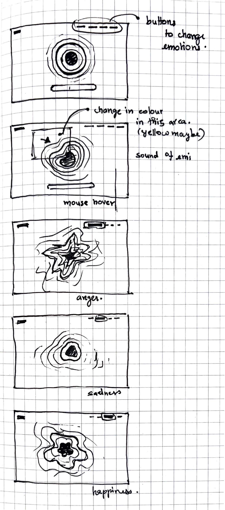
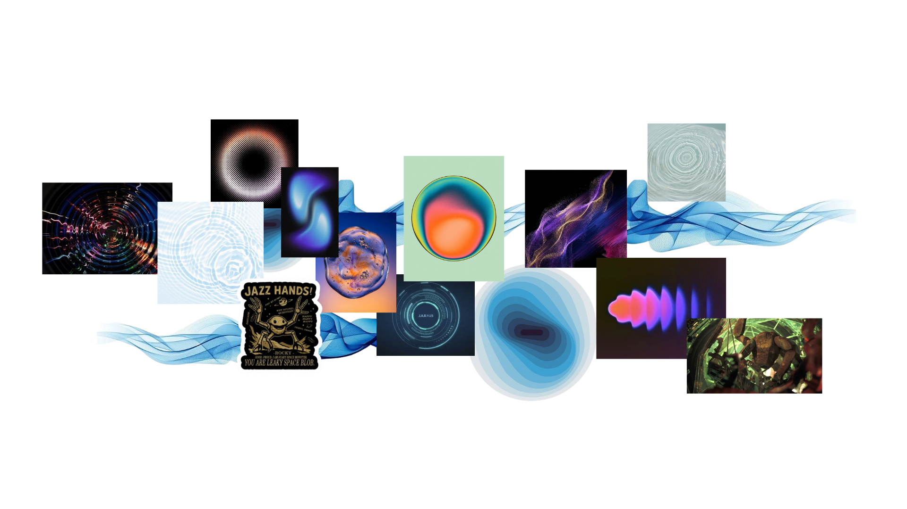
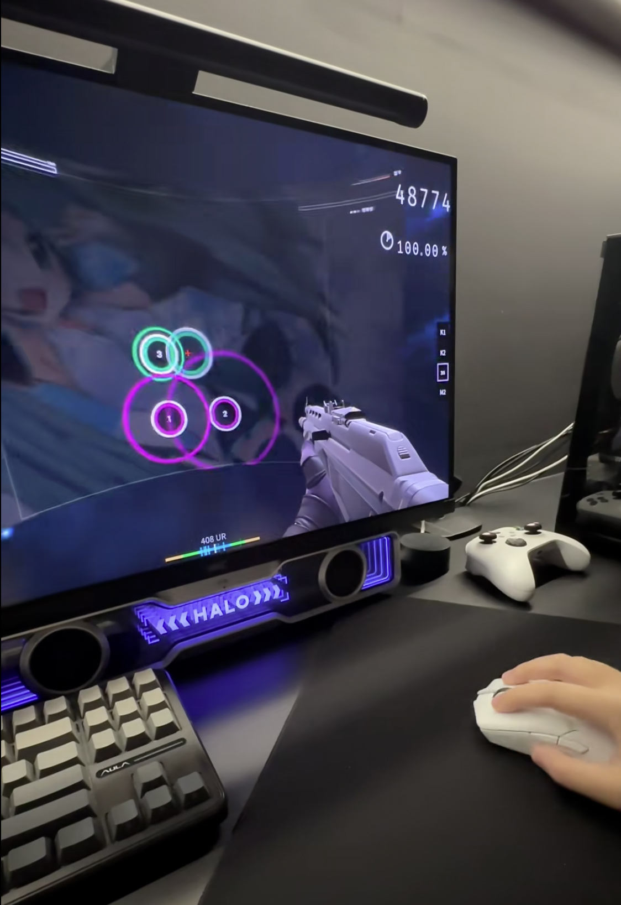
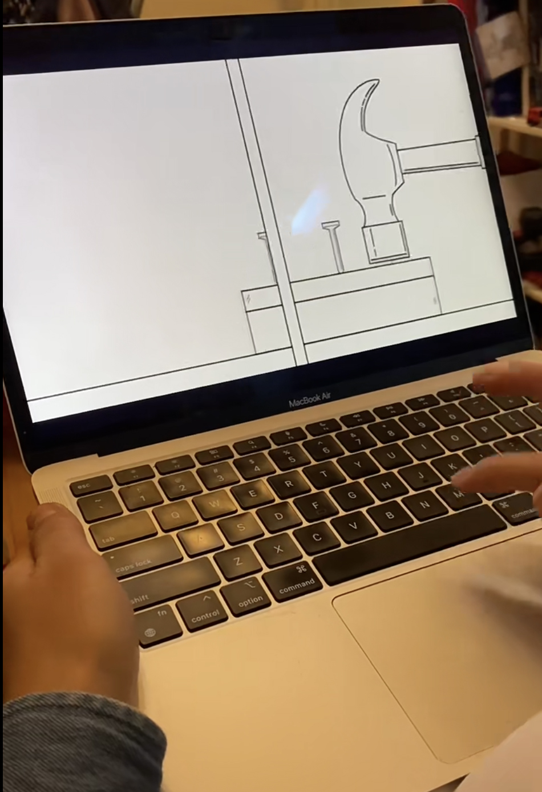
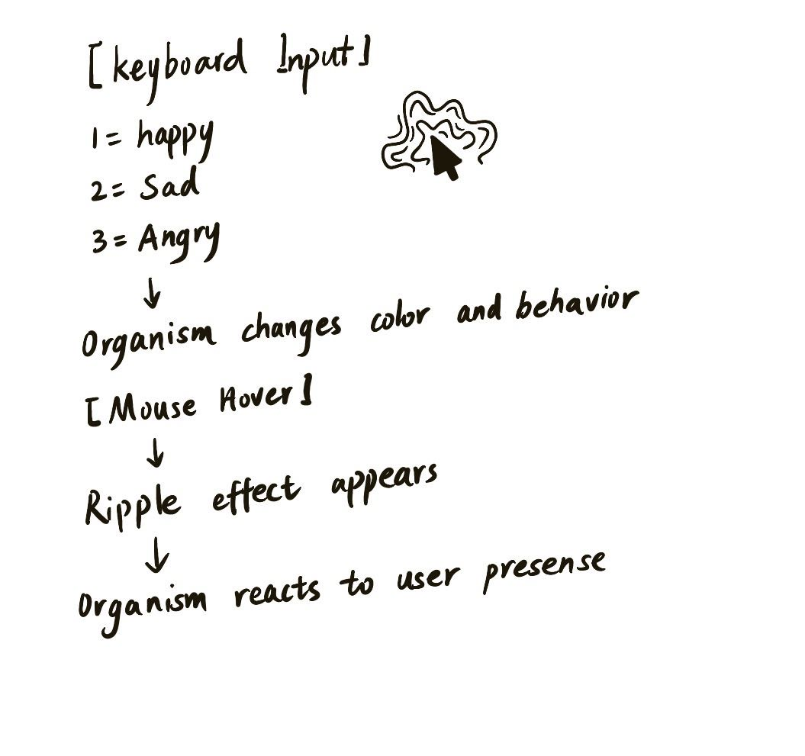

# 9103-GROUPWORK
# Final Project Pitch
## Inspirations
- **Links**
    - *Link 1* 
[Inspiration link1](https://www.tiktok.com/@gaabz.drop/video/7637272522060287239?q=Jarvis&t=1778729950655)
    - *Link 2*
[Inspiration link2](https://www.tiktok.com/@projecthailmary/video/7620935910770707743?q=Project%20Hail%20Mary%20Rocky&t=1778729762426)

## Part 1: **Project Direction**
### Project Path
For our Creative Coding final project, we aim to create an immersive and interactive experience that is built on abstract ideas like experiencing emotions. We have collectively decided to create a concept from scratch and not repurpose any existing artwork. We will, however, take inspiration for art styles, colour palette, and visual language to maintain consistency. 

Our concept takes inspiration from various characters that portray other worldly characteristics like Rocky from Project Hail Mary, Stitch from Lilo and Stitch and Emi from Ultraman: Rising. The idea is to portray emotions without the use of the word, and communication can be extended to visual, sound, and reaction.  

In immersive side of things, the concept takes inspiration from Tamagotchi. The users have to interact with an abstract idea of life, similar to that of an amoeba or an alien. The organisms would react based on user input and movement. 

### Vision
- **Pictures**
    - *Picture 1*

    - *Picture 2*

---

## Part 2: **Mechanics**

### Mechanic 1 — *Audio*
The audio mechanic drives the emotional atmosphere of the piece through two layers of sound. After entering the page, a gentle ambient track plays automatically, establishing a neutral mood. When the user selects an emotion from happiness, sadness, anger and fear, the background music transitions immediately to a corresponding track that reflects the emotional state. Additionally, when the user hovers over the digital pet, a unique sound effect is triggered, with each emotion producing a distinctly different response. 

- **Pictures**
    - *Picture 1*

    - *Picture 2*

### Mechanic 2 — *Time-based*
The time-based mechanic controls the emotional pacing and evolution of the interactive environment. Over time, the abstract form gradually changes its movement, colour intensity, particle behaviour, and animation speed, allowing each emotional state to feel alive and constantly evolving. 

Timed events will trigger subtle environmental transitions and visual reactions even when the user is not interacting directly. For example, the system may slowly become calmer, more energetic, or more chaotic depending on the active emotional mode. 

### Mechanic 3 — *Perlin Noise + Randomness*
The Perlin noise mechanic will explore reactions to user movements and input. This is particularly intended to make the reactions natural. The mechanism will create different frequency of ripple effect based on the user's input or movement. Additionally, the noise would have a standby mode where the lines move in a rhythmic pulsing manner to denote breathing or appearance of being alive. 

The noise is also applied directly to visual properties such as line weight, allowing the ripple effect to be expressed in an exaggerated, gestural way that emphasizes movement and energy. 

### Mechanic 4 — *User Input*
The user input mechanism enables users to interact directly with the digital organism through keyboard and mouse control. Different keyboard numbers will represent different emotions, such as happiness, sadness, and anger. When the user presses one of the keys, the organism will change its color and behavior. 

Mouse interaction can also create connections between users and organisms. When the user hovers the mouse over the organism, a ripple-like visual effect will appear around its body. 

This mechanism supports the project's concept of emotional expression and interaction by allowing users to influence the organism's emotions and responses in real time.

- **Pictures**

---

## Part 3: **Putting It Together**
All four mechanics work together in one interactive environment. Mouse movement and clicking allow users to interact with the abstract form directly. Audio creates sound feedback and changes visual reactions. Perlin noise and randomness make the movement feel organic and unpredictable. The time-based mechanic triggers automatic events, visual effects, and sound changes over time, helping the experience feel alive and always changing. Together, the mechanics create a connected emotional audiovisual experience through motion, interaction, sound, and atmosphere. 