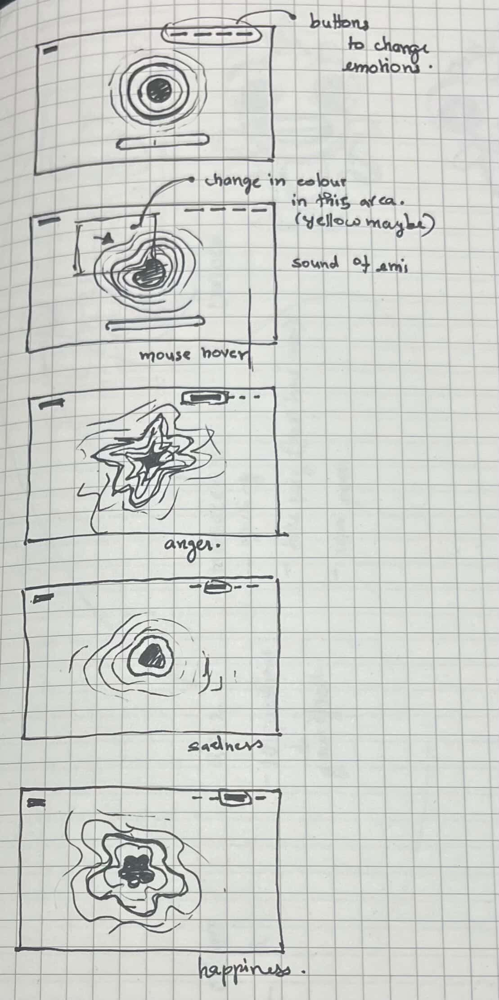

# 9103-GROUPWORK
# Final Project Pitch
## Inspirations
[Inspiration link1](https://www.tiktok.com/@gaabz.drop/video/7637272522060287239?q=Jarvis&t=1778729950655)
    - *Link 2*
[Inspiration link2](https://www.tiktok.com/@projecthailmary/video/7620935910770707743?q=Project%20Hail%20Mary%20Rocky&t=1778729762426)

## Part 1: **Project Direction**
### Project Path

### Vision

---

## Part 2: **Mechanics**

### Mechanic 1 — *Audio*
The audio mechanic drives the emotional atmosphere of the piece through two layers of sound. After entering the page, a gentle ambient track plays automatically, establishing a neutral mood. When the user selects an emotion from happiness, sadness, anger and fear, the background music transitions immediately to a corresponding track that reflects the emotional state. Additionally, when the user hovers over the digital pet, a unique sound effect is triggered, with each emotion producing a distinctly different response. 

### Mechanic 2 — *Time-based*
The time-based mechanic controls the emotional pacing and evolution of the interactive environment. Over time, the abstract form gradually changes its movement, colour intensity, particle behaviour, and animation speed, allowing each emotional state to feel alive and constantly evolving. 

Timed events will trigger subtle environmental transitions and visual reactions even when the user is not interacting directly. For example, the system may slowly become calmer, more energetic, or more chaotic depending on the active emotional mode. 

### Mechanic 3 — *Perlin Noise + Randomness*
...

### Mechanic 4 — *User Input*
The user input mechanism enables users to interact directly with the digital organism through keyboard and mouse control. Different keyboard numbers will represent different emotions, such as happiness, sadness, and anger. When the user presses one of the keys, the organism will change its color and behavior. 

Mouse interaction can also create connections between users and organisms. When the user hovers the mouse over the organism, a ripple-like visual effect will appear around its body. 

This mechanism supports the project's concept of emotional expression and interaction by allowing users to influence the organism's emotions and responses in real time.

---

## Part 3: **Putting It Together**
All four mechanics work together in one interactive environment. Mouse movement and clicking allow users to interact with the abstract form directly. Audio creates sound feedback and changes visual reactions. Perlin noise and randomness make the movement feel organic and unpredictable. The time-based mechanic triggers automatic events, visual effects, and sound changes over time, helping the experience feel alive and always changing. Together, the mechanics create a connected emotional audiovisual experience through motion, interaction, sound, and atmosphere. 