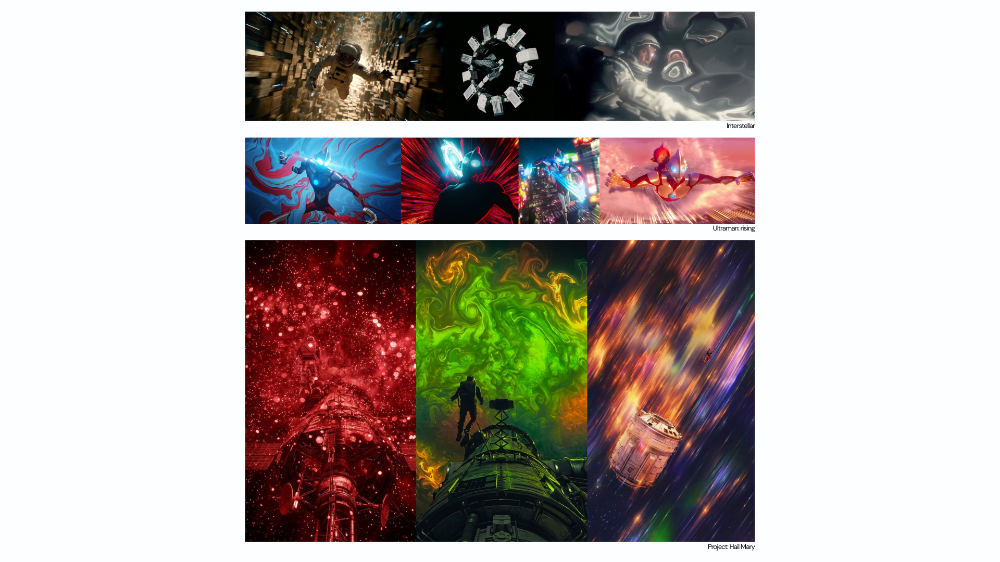
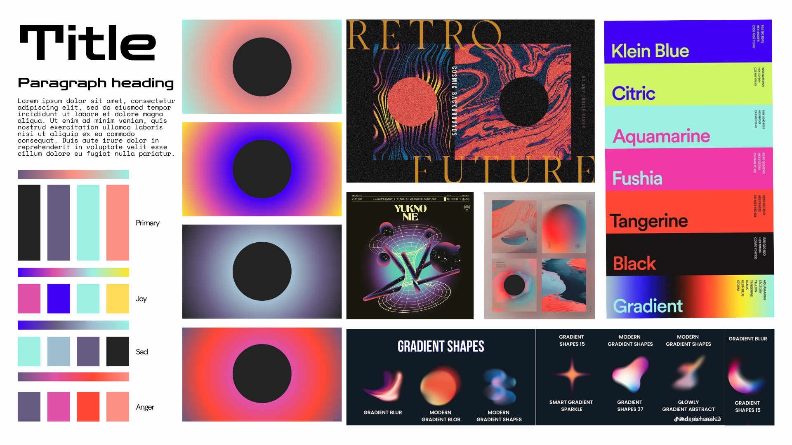

# 9103-GROUPWORK
# Final Project Pitch

4. AI acknowledgement: If you used ChatGPT, Claude, DeepSeek, or any other AI tool to help generate code, you must reference it here and explain what it was used for and how the generated code works. This must also be commented in the actual code (e.g. // this code was generated with the help of ChatGPT and does xyz).
5. External references: If you borrowed or were influenced by code found online, in a book, or from any other source, reference it with a link and an explanation. This must also be commented in the code (e.g. // this technique is from www.source-url.com).

## Inspirations
- **Links**
    - *Link 1* 
[Inspiration link1](https://www.tiktok.com/@gaabz.drop/video/7637272522060287239?q=Jarvis&t=1778729950655)
    - *Link 2*
[Inspiration link2](https://www.tiktok.com/@projecthailmary/video/7620935910770707743?q=Project%20Hail%20Mary%20Rocky&t=1778729762426)

## Part 1: **Project Direction**
### Project Path
For our Creative Coding final project, we aim to create an immersive and interactive experience that is built on abstract ideas like experiencing emotions.  

Our concept takes inspiration from various characters that portray other worldly characteristics like Rocky from Project Hail Mary, Stitch from Lilo and Stitch and Emi from Ultraman: Rising. The idea is to portray emotions without the use of the word, and communication can be extended to visual, sound, and reaction.  

In immersive side of things, the concept takes inspiration from Tamagotchi. The users have to interact with an abstract idea of life, similar to that of an amoeba or an alien. The organisms would react based on user input and movement. 

To start off with the project we settled on a cohesive visual language to maintain consistency. This design system includes gradients pertaining to each emotion case, typography that maintains visual hierarchy and a set of use case examples. 

Further we began ideating and working out the interactions in meaningful ways.

### Vision
    - *Picture 1*

---
## Part 2: **Techniques**
1. Smooth Shape Noise: 
To avoid the chaotic and glitchy look of standard random numbers, the core organism uses p5.js noise(xoff, yoff) calculated within a loop of circular coordinates (cos(a), sin(a)). This technique allows the perimeter of the shape to deform in an organic, mathematically continuous, and wave-like way.

2. Main State Controller:
 We used a main state tracker variable (currentEmotion) to act as the master controller. A key decision our team made was directly linking the shape's specific movement properties—such as updating speed (noiseSpeed) and how bumpy the shape gets (targetNoiseAmp)—to this switcher, so the entire animation logic adapts dynamically on the fly.

3. Separated Animation Code:
 To keep the program running smoothly at a high frame rate, we separated the continuous background body calculations from the short-duration particle systems (such as circles, tears, joySprays, and angerLasers). While the particle arrays compute their own independent motion frame-by-frame, the baseline breathing and heartbeat cycles are computed concurrently in the background by pulling time scales from the time-mechanic.js API (getTimedRadius()).

4. Custom Radial Gradients:
 We bypassed standard solid fills by interfacing directly with the browser's native canvas features right inside p5.js using drawingContext.createRadialGradient. This decision enabled us to programmatically blend customized multi-colored radial background rings that transition seamlessly based on system environment variables.

 5. Audio-Driven Visuals: We used p5.FFT to extract bass frequency energy from the background music in real time, then mapped it using map() to drive visual properties across the organism and background. A key decision was connecting the analyser dynamically by .connect(fft) on each track switch, rather than a single time binding, to ensure the FFT always reads the correct track as emotional states change.

---
## Part 3: **Mechanics**

### Mechanic 1 — qlyu0817-*Audio*
The audio mechanic was built based on the two core ideas of real-time frequency analysis and reactive sound design. To make a sense of live on the organism, the built-in p5.FFT class of p5.js was used to read the frequency of the background music. There is also a smoothing value of 0.8 to ensure smooth transitions between each frames, and 128 bins for balanaced frenquency resolution. The fft.getEnergy("bass") method extracts the low-frequency energy from each frame, which is then mapped using p5's map() function to drive the organism's shifts on colour, saturation, and brightness. The expansion and contraction of the radial background gradient changes were set under the same method. Audio tracks are loaded in preload() using loadSound() and switched dynamically through .connect(fft), ensuring the analyser always reads the currently playing track. On top of that, the mechanic manages a layered sound system where sound.loop(), sound.stop(), and sound.isPlaying() control background music and hover sounds across all four emotional states, making the creature feel genuinely responsive to both the music and the user.

- **p5.js Link References**
    - *p5.FFT*

    - *p5.FFTgetEnergy()*

    - *loadSound()*

    - *map()*

    - *p5.SoundFile loop()/stop()/isPlaying()*

### Mechanic 2 — jwan0684-*Time-based*
My time-based mechanic serves as the master clock and biological life-support engine of the organism. It independently regulates four temporal behaviors: a global lifestyle progression, harmonic breathing, threshold-triggered heartbeats, and a emotional decay fallback.
1. Organic Respiration (Breathing Motion):
To prevent the organism from appearing static in its neutral state, I utilized `millis()` inside `getTimedRadius()` to drive continuous harmonic oscillation via `sin()`. By transforming linear execution time into a smooth, periodic sine wave, the baseline radius of the biological membrane expands and contracts automatically, mimicking natural breathing.
2. Cardiovascular Simulation (Heartbeat Pulses):
 I programmed a non-blocking interval timer that tracks threshold milestones. When elapsed time hits the designated pulse interval, the mechanic triggers a momentary, sharp exponential spike in the organism's vector scaling before rapidly dampening it. This produces a visceral, periodic "thump" that visually simulates a living heartbeat.
3. Temporal Lifecycle Progression (Ageing System):
I established a macro-lifecycle loop that tracks the total uptime of the program. This system gradually shifts the global baseline scale and alpha opacity variables over extended periods. It smoothly morphs the entity through conceptual phases of birth, structural maturity, and eventual fading, ensuring the visual experience evolves over time.
4. Synchronized Emotional Lifespan & Decay:
To solve the user-experience drag caused by uneven audio track lengths (such as the 4-minute 41-second Sorrow track), I designed a strict, authoritative 107,000ms expiration timer within `updateEmotionDecay()`. Once `millis() - emotionStartTime` exceeds this limit, `isDecaying` flips to true. I then utilized `map()` and `constrain()` to linearly interpolate `decayProgress` from `0` to `1` over a strict 2000ms window. This forces the heightened visual properties (morphing speed, color saturation, and spiky noise amplitudes) to gracefully flatten back to their neutral baselines, while simultaneously triggering `playTrack(0)` to seamlessly truncate the overflowing audio stream.

- **p5.js Link References**
    - [p5.js millis() Reference](https://p5js.org/reference/p5/millis/)
    - [p5.js sin() Reference](https://p5js.org/reference/p5/sin/)
    - [p5.js map() Reference](https://p5js.org/reference/p5/map/)
    - [p5.js constrain() Reference](https://p5js.org/reference/p5/constrain/)

### Mechanic 3 — skar0152-*Perlin Noise + Randomness*
The Perlin noise mechanic will explore reactions to user movements and input. This is particularly intended to make the reactions natural. The mechanism will create different frequency of ripple effect based on the user's input or movement. Additionally, the noise would have a standby mode where the lines move in a rhythmic pulsing manner to denote breathing or appearance of being alive. 

The noise is also applied directly to visual properties allowing the ripple effect to be expressed in an exaggerated, gestural way that emphasizes movement and energy. 

### Mechanic 4 — yyao0435-*User Input*
The user input mechanism enables users to interact directly with the digital organism through keyboard and mouse control. Different keyboard numbers will represent different emotions, such as happiness, sadness, and anger. When the user presses one of the keys, the organism will change its color and behavior. 

Mouse interaction can also create connections between users and organisms. When the user hovers the mouse over the organism, a ripple-like visual effect will appear around its body. 

This mechanism supports the project's concept of emotional expression and interaction by allowing users to influence the organism's emotions and responses in real time.

- **Pictures**

---
## Part 4: **AI acknowledgement**
We have used Claude for our project, we have used it to understand, write and debug the code in the following lines:
1) The Organism: While the orginal code is derived from https://www.youtube.com/watch?v=rX5p-QRP6R4&t=523s, it was modified in multiple ways to incorporate into our concept. The blob is built on polar coordinates, defined by a radius and an angle which is then converted to x/y through " x = r.cos(a)" and " y = r.sin(a)". The noise offset is intended to create inward and outward motion. As the angle advances around the circle, xoff steps through noise space: a bigger step (anger - 0.25) hits more distant, jagged values producing spiky edges; a smaller step (joy - 0.08) samples nearby values for gentle waves. yoff advances every frame, sliding through the noise field to animate the shape over time. The 10 layers all use the same noise but scale radius by layer/10 and fade from transparent to opaque outward-in, creating the glowing depth effect.

2) mouseHover: The initial understanding of this function was retrived at https://p5js.org/reference/p5.Element/mouseOver/. To make the organism react to the mouse by first calculating the straight line from the cursor to the organism with Pythagorean theorem. If the distance is within 300px, the 'targetRepel' is mapped inversley. When the mouse is close enough to repel when the organism is in a relaxed state (i. e repelFactor is less than 0.1), the flinching motion is sharperned and spikes to +0.3 per frame. Once flinching motion is complete, repelFactor is eased with 'lerp()' with 5% blend factor.

3) Dynamic FFT connection: Referred from https://p5js.org/reference/p5.sound/p5.FFT/, the method helped with connecting audio tracks dynamically to the FFT analyser using .connect(fft) inside playTrack(), so that the analyser updates correctly each time the background music switches between emotional states.

4) Bass energy to visual mapping: Referred from https://p5js.org/reference/p5.FFT/getEnergy/, the method helped with mapping the bass energy output from fft.getEnergy("bass") to the organism's colour, saturation, and brightness inside drawOrganism(), creating a visible response to the music each frame.

5) Audio-driven background gradient: Referred from https://p5js.org/reference/p5/map/, it helped with mapping the same bass energy value to the radial gradient radius inside drawEmotionBackground(), so the background expands and contracts in response to the music.

## Part 5: **External references**
### p5.js Reference
[p5js reference link](https://p5js.org/reference/)

1. The p5.js Reference was used to understand and implement built-in functions including:

- millis()
- sin()
- map()
- lerp()
- constrain()
- getEnergy()

These functions were used to create timed animation, lifecycle transitions, breathing motion, heartbeat pulses, and emotional decay behaviour throughout the project.

1. Gradient Background: https://www.youtube.com/watch?v=-MUOweQ6wac&t=1s
2. Blob: https://www.youtube.com/watch?v=rX5p-QRP6R4&t=523s
3. mouseHover: https://p5js.org/reference/p5.Element/mouseOver/
4. Bass energy to visual mapping: https://www.youtube.com/watch?v=ATLhkFcQZN0
5. Audio-driven background gradient: https://www.youtube.com/watch?v=VUvVFOYmwgk&list=PLaPCMjX1ETdOQWorX-vcbMM6X-kdmVUAx

## Part 6: **Interaction instructions**
Wait for the ambient soundtrack to begin.
Press:
0 = Netural
1 = Joy
2 = Sorrow
3 = Anger
Hover the mouse over the organism to trigger a flinch reaction and interactive sound feedback. Click on the organism to interact. In the emotion of Joy, particles burst outward; in Sorrow, tears fall and create ripples; in Anger, laser beams are fired outward. Observe how the organism responds through changes in movement, colour, breathing rhythm, and heartbeat. Stay within the experience to witness automatic time-based lifecycle changes and emotional decay back to a neutral state after a period of inactivity.

## Part 7: **Putting It Together**
All four mechanics work together in one interactive environment. Mouse movement and clicking allow users to interact with the abstract form directly. Audio creates sound feedback and changes visual reactions. Perlin noise and randomness make the movement feel organic and unpredictable. The time-based mechanic triggers automatic events, visual effects, and sound changes over time, helping the experience feel alive and always changing. Together, the mechanics create a connected emotional audiovisual experience through motion, interaction, sound, and atmosphere. 